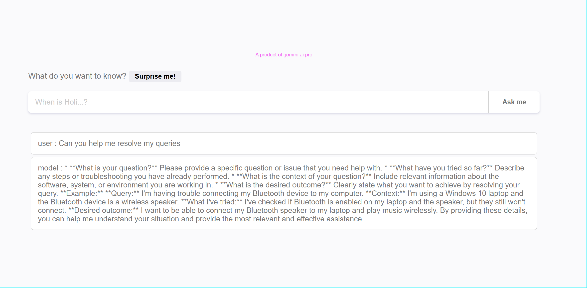

# AI Chat Application

This is an AI Chat Application built using Gemini-Pro, React, Node.js, and Express. With this application, users can engage in conversations with an AI and receive answers to their queries.

## Features
- **AI Chat**: Users can chat with an AI and receive responses.
- **Gemini-Pro Model**: The application utilizes the Gemini-Pro model of Gemini for AI conversation.
- **Rate Limiting**: To prevent overload, the application implements rate limiting, allowing only 5 requests per minute.

## Technologies Used
- **Frontend**: React
- **Backend**: Node.js, Express
- **AI Model**: Gemini-Pro

## Installation
1. Clone the repository.
2. Navigate to the project directory.
3. Install dependencies for both frontend and backend:
   ```bash
   cd gemini-client
   npm install
   cd ..
   cd gemini-server
   npm install
   ```

4. Create .env files in both client and server folders
5. Add in server env file
   ```bash
      GEMINI_GEN_AI_KEY = 
      PORT = 
      CLIENT_URL = 
   ```
6. Add in client env file
   ```bash
      VITE_API_URL = 
   ```
8. Run the application in development mode
   ```bash
    // Client
    npm run dev
    
    // Server
    npm run dev
```



